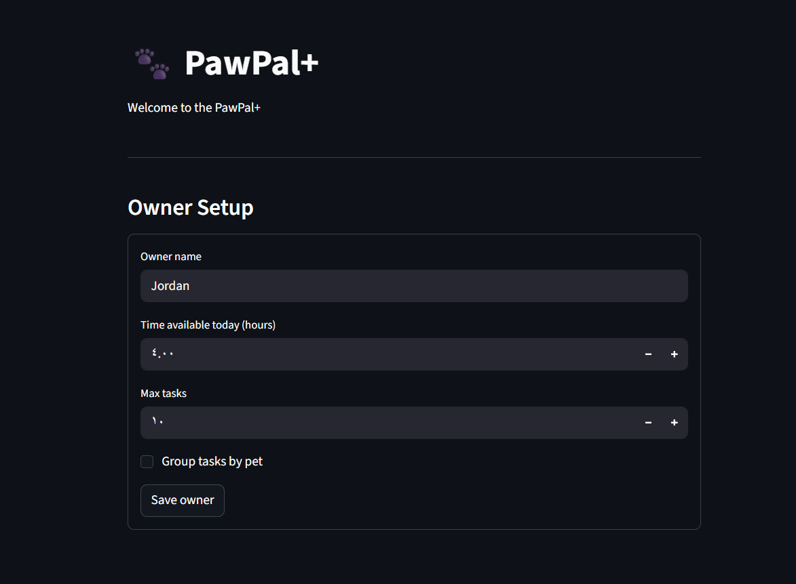

# PawPal+ (Module 2 Project)

You are building **PawPal+**, a Streamlit app that helps a pet owner plan care tasks for their pet.

## Scenario

A busy pet owner needs help staying consistent with pet care. They want an assistant that can:

- Track pet care tasks (walks, feeding, meds, enrichment, grooming, etc.)
- Consider constraints (time available, priority, owner preferences)
- Produce a daily plan and explain why it chose that plan

Your job is to design the system first (UML), then implement the logic in Python, then connect it to the Streamlit UI.

## What you will build

Your final app should:

- Let a user enter basic owner + pet info
- Let a user add/edit tasks (duration + priority at minimum)
- Generate a daily schedule/plan based on constraints and priorities
- Display the plan clearly (and ideally explain the reasoning)
- Include tests for the most important scheduling behaviors

## Getting started

### Setup

```bash
python -m venv .venv
source .venv/bin/activate  # Windows: .venv\Scripts\activate
pip install -r requirements.txt
```

### Suggested workflow

1. Read the scenario carefully and identify requirements and edge cases.
2. Draft a UML diagram (classes, attributes, methods, relationships).
3. Convert UML into Python class stubs (no logic yet).
4. Implement scheduling logic in small increments.
5. Add tests to verify key behaviors.
6. Connect your logic to the Streamlit UI in `app.py`.
7. Refine UML so it matches what you actually built.

## Features

- **Priority-based scheduling** — tasks are sorted by priority (1 = highest) and greedily fitted into the owner's daily time budget
- **Sorting by time** — tasks with a `preferred_time` (HH:MM) are ordered chronologically; tasks without a time appear last
- **Conflict warnings** — tasks sharing the same preferred time are flagged in the schedule's reasoning output
- **Group by pet** — optional preference to cluster tasks by pet while preserving priority order within each group
- **Daily recurrence** — tasks marked `DAILY` or `WEEKLY` automatically generate a next-occurrence task with the correct due date on completion
- **Explainable output** — every generated schedule includes a human-readable summary of what was scheduled, what was dropped, and why
- **Task filtering** — filter tasks by completion status or by pet name

## 📸 Demo



## Smarter Scheduling

The scheduler goes beyond basic task listing with several features:

- **Priority-based filtering** — tasks are sorted by priority (1 = highest) and fitted into the owner's time budget. Tasks that don't fit are dropped and reported.
- **Preferred times** — each task can have an optional `preferred_time` (HH:MM format). The schedule is sorted chronologically so the daily plan reads like a timeline.
- **Conflict detection** — if two or more tasks share the same preferred time, the scheduler flags them with a warning in the reasoning output.
- **Group by pet** — an optional preference that clusters tasks for the same pet together in the schedule.
- **Recurring tasks** — tasks can be set to `DAILY` or `WEEKLY` frequency. When marked complete, `mark_complete()` returns a new task instance with the next due date calculated via `timedelta`.
- **Explainable output** — every schedule includes a reasoning summary: what was scheduled, what was dropped and why, whether grouping was applied, and any detected conflicts.

## Testing PawPal+

### Running the tests

```bash
python -m pytest
```

### What the tests cover

The test suite has 20 tests across five areas:

- **Task lifecycle** — tasks start incomplete; `mark_complete()` sets `completed = True`.
- **Recurring tasks** — daily and weekly tasks produce a new instance with the correct next due date; completing a `ONCE` task returns `None`; tasks with no due date fall back to `date.today()`; the returned next-occurrence task is independent of the original.
- **Scheduling** — tasks are ordered by priority before time-fitting; tasks that exceed the time budget are dropped; the `max_tasks` cap excludes the lowest-priority tasks before any time-fitting occurs; an owner with zero time available gets an empty schedule.
- **Conflict detection** — tasks sharing a `preferred_time` produce exactly one warning per slot; tasks with no preferred time are never flagged.
- **Filtering** — completed tasks are removed by `filter_completed_tasks`; `filter_tasks_by_pet` returns only tasks for the named pet.

### Confidence Level

★★★★☆ (4 / 5)

The core scheduling logic — priority ordering, time-budget enforcement, `max_tasks` cap, and recurring task generation — is fully covered and all 20 tests pass. One star is held back because the end-to-end `schedule()` calls with grouping preferences active are not covered.
